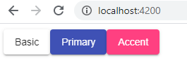

# 01. Настройка проекта 

## Проверяем установлен ли nodejs, npm, angular:  

`node -v`    
`npm -v`    
`ng --version`    

## Создаем angular проект 'angular-material-lessons' с помощью флагов, которые добавят роутинг и уберут тесты: 

`ng new angular-material-lessons --routing=true --skipTests=true`   

## Устанавливаем Angular Material зависимости:     

`npm install @angular/material @angular/cdk  @angular/animations hammerjs`    

Где:   
- @angular/material - библиотека готовых компонентов
- @angular/cdk - Component Development Kit, позволяет создавать drag&drop, виртуальный скроллинг, управление фокусом и др.
- @angular/animations - библиотека анимаций, необходима при работе с angular/material
- hammerjs - библиотека, которая необходима при использовании приложений на мобильных устройствах (добавляет поддержку swipe, pan, zoom, rotate и др.)

## Подключаем *hammerjs* в *src\main.ts*:

```js
import 'hammerjs';
```

## Подключаем тему виджета в *src\styles.css* (доступные темы находятся по адрессу *node_modules\@angular\material\prebuilt-themes*):

```css
@import "~@angular/material/prebuilt-themes/indigo-pink.css";
```

## Добавляем Google Material Icons Font в *src\index.html* (доступные иконки https://material.io/resources/icons):

```html
<link href="https://fonts.googleapis.com/icon?family=Material+Icons" rel="stylesheet">
```

## Проверим работу Angular Material:

Удалим все содержимое *src\app\app.component.html* и добавим кнопки, используя material-директивы:
```html
<button mat-raised-button>Basic</button>
<button mat-raised-button color="primary">Primary</button>
<button mat-raised-button color="accent">Accent</button>
```

Подключим модуль MatButtonModule в *src\app\app.module.ts*:
```js
import { MatButtonModule } from '@angular/material/button';
@NgModule({
  imports: [
    MatButtonModule,
  ],
})

```

Запускаем проект на http://localhost:4200:   
`npm start`

Результат:     
