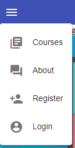

## 03. dropdown-меню

**Задача урока - создать dropdown-меню навигации** используя `MatMenuModule` из библиотеки '@angular/material' (https://material.angular.io/components/menu/overview)

### 1. Создание top-menu компонента

Создаем компонент top-menu, в котором будет расположено меню:  
`ng g c top-menu`

Подключаем компонент в *src\app\app.component.html*:
```html
<top-menu></top-menu>
<!-- ... -->
```

Задаем стили для компонента в *src\app\top-menu\top-menu.component.css*:
```css
/* :host ссылается на элемент, в котором хостится компонент, в данном случае это <top-menu></top-menu> */
:host {
  width: 100%;
  height: 42px;
  display: block;
  background: #3f51b5;
  color: white;
}
```

### 2. Создание кнопки для меню

Используя https://material.angular.io/components/menu/examples создаем кнопку для меню *src\app\top-menu\top-menu.component.html*:
```html
<button mat-icon-button>
  <mat-icon>menu</mat-icon>
</button>
```

В качестве иконок используем библиотеку - https://material.io/resources/icons/?style=baseline

В результате получаем следующее:   


### 3. Создание меню

Используя https://material.angular.io/components/menu/examples создаем выпадающее меню *src\app\top-menu\top-menu.component.html*:
```html
<!-- [matMenuTriggerFor]="menu" указывает, что при нажатии кнопки должен сработать тригер "menu" -->
<button 
  mat-icon-button
  [matMenuTriggerFor]="menu"
>
  <mat-icon>menu</mat-icon>
</button>

<!-- mat-menu компонент будет невидим, пока не сработает тригер #menu -->
<mat-menu #menu>

  <!-- mat-menu-item - директива для создания елемента меню -->
  <button mat-menu-item routerLink="/">
    <mat-icon>library_books</mat-icon>
    <span>Courses</span>
  </button>

  <button mat-menu-item routerLink="/about">
    <mat-icon>question_answer</mat-icon>
    <span>About</span>
  </button>

  <button mat-menu-item>
    <mat-icon>person_add</mat-icon>
    <span>Register</span>
  </button>

  <button mat-menu-item>
    <mat-icon>account_circle</mat-icon>
    <span>Login</span>
  </button>
  
</mat-menu>
```

В результате получаем следующее:   
