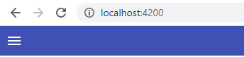

## 03. Меню навигации

На данном этапе существуют:
- 2 компоненты - about и home
- роутинг *src\app\app-routing.module.ts*
- интерфейс ICourse *src\app\model\course.ts*
- база данных *src\app\model\db-data.ts*

**Задача урока - создать меню навигации** используя `MatMenuModule` из библиотеки '@angular/material' (https://material.angular.io/components/menu/overview)

### 1. Создание top-menu компонента

Создаем компонент top-menu, в котором будет расположено меню:  
`ng g c top-menu`

Подключаем компонент в *src\app\app.component.html*:
```html
<top-menu></top-menu>
<!-- ... -->
```

Задаем стили для компонента в *src\app\top-menu\top-menu.component.css*:
```css
/* :host ссылается на элемент, в котором хостится компонент, в данном случае это <top-menu></top-menu> */
:host {
  width: 100%;
  height: 42px;
  display: block;
  background: #3f51b5;
  color: white;
}
```

### 2. Создание кнопки для меню

Используя https://material.angular.io/components/menu/examples создаем кнопку для меню *src\app\top-menu\top-menu.component.html*:
```html
<button mat-icon-button>
  <mat-icon>menu</mat-icon>
</button>
```

В качестве иконок используем - https://material.io/resources/icons/?style=baseline

В результате получаем следующее:   
