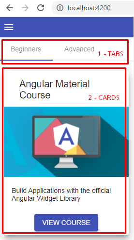

## 04. tabs и cards

При переходе на http://localhost:4200/ отображается home-компонент. **Задача урока** - реализовать в рамках home-компонента страницу, на которой будут отображаться все курсы:    
   

- 1 - создать TABS в рамках home-компонента, используя https://material.angular.io/components/tabs/examples
- 2 - создать CARDS в рамках courses-card-list-компонента, который будет дочерним для home-компонента, используя https://material.angular.io/components/card/examples

### 1. Создание TABS

*src\app\home\home.component.html*:
```html
<mat-tab-group>
  <mat-tab label="Beginners">

    <!-- 
      [courses]="beginnerCourses" - 
      передаем input-переменной courses,
      которая размещена в дочернем компоненте courses-card-list,
      значение переменной beginnerCourses
    -->
    <courses-card-list [courses]="beginnerCourses"></courses-card-list>
    
  </mat-tab>
  <mat-tab label="Advanced">
    <courses-card-list [courses]="advancedCourses"></courses-card-list>
  </mat-tab>
</mat-tab-group>
```

### 2. Создание CARDS

Создаем компонент courses-card-list:  
`ng g c courses-card-list`

*src\app\courses-card-list\courses-card-list.component.html*:
```html
<mat-card *ngFor="let course of courses" class="course-card mat-elevation-z10">

  <mat-card-header>
    <mat-card-title>{{ course.description }}</mat-card-title>
  </mat-card-header>

  

  <mat-card-content>
    <p>{{ course.longDescription }}</p>
  </mat-card-content>

  <mat-card-actions class="course-actions">
    <button mat-button class="mat-raised-button mat-primary">VIEW COURSE</button>
  </mat-card-actions>
</mat-card>
```

*src\app\courses-card-list\courses-card-list.component.css*:
```css
.course-card {
  margin: 20px 10px;
}
.course-actions {
  text-align: center;
}
```