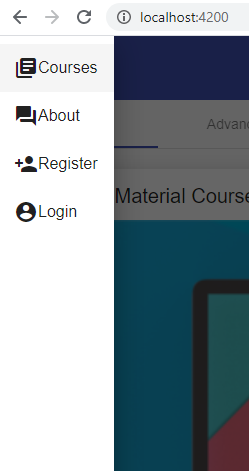

## 05. side-меню

**Задача урока - заменить dropdown-меню на side-меню** используя https://material.angular.io/components/sidenav/overview.  
 
*src\app\app.component.html*:
```html
<!-- Закоментированный код - реализация dropdown-меню -->
<!-- 
  <top-menu></top-menu>
  <main>
    <router-outlet></router-outlet>
  </main> 
-->

<mat-sidenav-container fullscreen>

  <mat-sidenav #start>
    <mat-nav-list>

      <a mat-list-item routerLink="/">
        <mat-icon>library_books</mat-icon>
        <span>Courses</span>
      </a>

      <a mat-list-item routerLink="/about">
        <mat-icon>question_answer</mat-icon>
        <span>About</span>
      </a>

      <a mat-list-item>
        <mat-icon>person_add</mat-icon>
        <span>Register</span>
      </a>

      <a mat-list-item>
        <mat-icon>account_circle</mat-icon>
        <span>Login</span>
      </a>

    </mat-nav-list>
  </mat-sidenav>

  <mat-toolbar color="primary">
    <!-- 
      (click)="start.open()" говорит, что нужно отобразить элемент
      который был помечен <mat-sidenav #start> 
    -->
    <button mat-icon-button (click)="start.open()">
      <mat-icon>menu</mat-icon>
    </button>
  </mat-toolbar>

  <router-outlet></router-outlet>

</mat-sidenav-container>
```

Результат:    
 