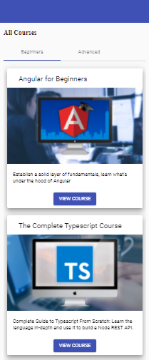
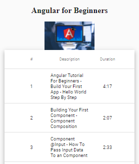

## 06. table, MatTableDataSource

В уроке №4 мы реализовали в рамках home-компонента страницу, на которой отображаются все курсы:   
  

**Задача данного урока** - находясь на странице со списком всех курсов и кликнув на "VIEW COURSE" - отображать таблицу со списком уроков, которые относятся к данному курсу. В качестве таблицы используем https://material.angular.io/components/table/examples:     
 

*src\app\course\course.component.html*:
```html
<!-- <div class="course"> -->
  <!-- ... -->

  <mat-table class="lessons-table mat-elevation-z8" [dataSource]="dataSource">
    <ng-container matColumnDef="seqNo">
      <mat-header-cell *matHeaderCellDef>#</mat-header-cell>
      <mat-cell *matCellDef="let lessons">{{ lessons.seqNo }}</mat-cell>
    </ng-container>

    <ng-container matColumnDef="description">
      <mat-header-cell *matHeaderCellDef>Description</mat-header-cell>
      <mat-cell class="description-cell" *matCellDef="let lessons">{{ lessons.description }}</mat-cell>
    </ng-container>

    <ng-container matColumnDef="duration">
      <mat-header-cell *matHeaderCellDef>Duration</mat-header-cell>
      <mat-cell class="duration-cell" *matCellDef="let lessons">{{ lessons.duration }}</mat-cell>
    </ng-container>

    <mat-header-row *matHeaderRowDef="displayedColumns"></mat-header-row>
    <mat-row *matRowDef="let row; columns: displayedColumns" ></mat-row>
  </mat-table>

<!-- </div> -->
```

*src\app\course\course.component.ts*:
```js
import { MatTableDataSource } from '@angular/material/table';

export class CourseComponent implements OnInit, AfterViewInit {
  // ...

  // MatTableDataSource предоставляет методы, с помощью которых
  // можно производить sort, paginate и filter массива данных
  // на стороне клиента.
  // DataSource будет передан в таблицу
  dataSource = new MatTableDataSource([]);
  
  displayedColumns = ["seqNo", "description", "duration"];

  ngOnInit() {
    this.course = this.route.snapshot.data['course'];
    this.coursesService.findAllCourseLessons(this.course.id)
      .subscribe(
        lessons => this.dataSource.data = lessons
      );
  }
}
```