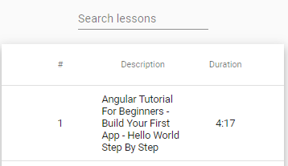

## 07. table, MatTableDataSource filter

**Задача урока** - добавить возможность фильтрации данных в таблице. Для этого мы создадим поле ввода на базе https://material.angular.io/components/input/examples, на основании которого будет происходить фильтрация с использованием мотода filter, который предоставляет класс MatTableDataSource (пример фильтрации https://material.angular.io/components/table/examples):     
    

Создаем поле ввода *src\app\course\course.component.html*:
```html
<div class="course">
  <!-- ... -->

  <mat-form-field>
    <input matInput placeholder="Search lessons"
      #input
      (keyup)="searchLessons(input.value)"
    >
  </mat-form-field>

  <!-- ... -->
</div>

```

С использованием мотода filter, который предоставляет класс MatTableDataSource, создаем фильтрацию данных *src\app\course\course.component.ts*:
```js
export class CourseComponent implements OnInit, AfterViewInit {
  // ...

  searchLessons(search) {
    this.dataSource.filter = search.toLocaleLowerCase().trim();
  }

}
```
