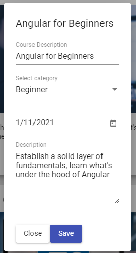
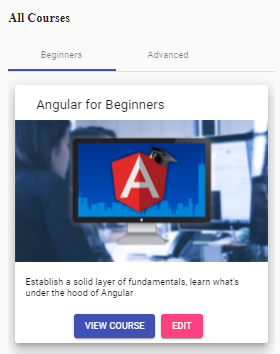

## 12. dialog-окно (datepicker, select)

Задача данного урока - создать angular-material-dialog окно (https://material.angular.io/components/dialog/examples), с помощью которого мы сможем редактировать данные курсов:    


dialog-окно будет находится в src\app\course-dialog\course-dialog.component.

Открытие dialog-окна будет происходить из courses-card-list.component компонента при клике EDIT:   


### 1. Открытие dialog-окна; получение данных после редактирования 

При клике EDIT срабатывает editCourse(). Реализуем его функционал в *src\app\courses-card-list\courses-card-list.component.ts*:
```js
import { Component, Input, OnInit, ViewEncapsulation } from '@angular/core';
import { Course } from '../model/course';
import { MatDialog, MatDialogConfig } from '@angular/material/dialog';
import { CourseDialogComponent } from '../course-dialog/course-dialog.component';

@Component({
  selector: 'courses-card-list',
  templateUrl: './courses-card-list.component.html',
  styleUrls: ['./courses-card-list.component.css'],
})
export class CoursesCardListComponent implements OnInit {
  @Input()
  courses: Course[];

  // Инжектим MatDialog
  constructor(private dialog: MatDialog) {}

  ngOnInit() {}

  // При клике EDIT - срабатывает метод editCourse
  editCourse({ description, longDescription, category }: Course) {
    // Объект конфигурации для dialog-окна
    const dialogConfig = new MatDialogConfig();

    // autoFocus - поместить фокус на первый элемент формы
    dialogConfig.autoFocus = true;
    dialogConfig.data = { description, longDescription, category };
    
    // open - открывает dialog-окно.
    // 1й параметр - имя компонента, который должен быть открыт;
    // 2й параметр - объект конфигурации, который будет получен внутри CourseDialogComponent.
    // open() возвращает экземпляр MatDialogRef, с помощью которого можно закрыть окно 
    // с помощью метода dialogRef.close (см. course-dialog компонент),
    // а также с помощью метода dialogRef.afterClosed - получить данные формы
    const dialogRef = this.dialog.open(CourseDialogComponent, dialogConfig);

    // Получаем данные формы, после её закрытия в course-dialog компоненте
    dialogRef.afterClosed().subscribe(
      val => console.log('Dialog output', val)
    )
  }
}
```

### 2. Создание dialog-окна

*src\app\course-dialog\course-dialog.component.html*:
```html
<h2 mat-dialog-title>{{ description }}</h2>

<mat-dialog-content [formGroup]="form">

  <mat-form-field>
    <input 
      matInput
      formControlName="description"
      placeholder="Course Description"
    >
  </mat-form-field>
  
  <mat-form-field>
    <mat-select placeholder="Select category"
      formControlName="category"
    >
      <mat-option value="BEGINNER">Beginner</mat-option>
      <mat-option value="INTERMEDIATE">Intermediate</mat-option>
      <mat-option value="ADVANCED">Advanced</mat-option>
    </mat-select>
  </mat-form-field>

  <mat-form-field>
    <input matInput [matDatepicker]="myDatepicker"
      formControlName="releasedAt"
    >
    <mat-datepicker-toggle matSuffix [for]="myDatepicker"></mat-datepicker-toggle>
    <mat-datepicker #myDatepicker></mat-datepicker>
  </mat-form-field>

  <mat-form-field>
    <textarea matInput placeholder="Description"
      formControlName="longDescription"
    ></textarea>
  </mat-form-field>

</mat-dialog-content>

<mat-dialog-actions>
  <button class="mat-raised-button"
    (click)="close()"
  >Close</button>
  <button class="mat-raised-button mat-primary"
    (click)="save()"
  >Save</button>
</mat-dialog-actions>
```

*src\app\course-dialog\course-dialog.component.ts*:
```js
import { Component, Inject, OnInit, ViewEncapsulation } from '@angular/core';
import { MAT_DIALOG_DATA, MatDialogRef } from '@angular/material/dialog';
import { Course } from '../model/course';
import { FormBuilder, Validators, FormGroup } from '@angular/forms';
import * as moment from 'moment';

@Component({
  selector: 'course-dialog',
  templateUrl: './course-dialog.component.html',
  styleUrls: ['./course-dialog.component.css'],
})
export class CourseDialogComponent implements OnInit {

  description: string;
  form: FormGroup;

  constructor(
    private fb: FormBuilder,

    // Инжектим MatDialogRef, который принимает параметр, который
    // соответствует компоненту, в котором находится тело dialog-окна
    private dialogRef: MatDialogRef<CourseDialogComponent>,

    // Чтобы получить данные dialogConfig.data, которые были отправлены 
    // из courses-card-list компонента методом editCourse,
    // нам необходимо заинжектить MAT_DIALOG_DATA
    @Inject(MAT_DIALOG_DATA) { description, longDescription, category }: Course // <-- 1 вариант
    // @Inject(MAT_DIALOG_DATA) data: Course // <-- 2 вариант (более понятная запись строки выше)

  ) {
    this.description = description; // <-- 1
    // this.description = data.description; // <-- 2

    this.form = fb.group({
      description: [description, Validators.required],
      category: [category, Validators.required],
      releasedAt: [moment(), Validators.required],
      longDescription: [longDescription, Validators.required],
    });
  }

  ngOnInit() {}

  save() {
    // закрываем dialog-окно и передаем данные формы,
    // которые будут получены в course-card-list компоненте
    this.dialogRef.close(this.form.value);
  }

  close() {
    // закрываем dialog-окно
    this.dialogRef.close();
  }
}
```