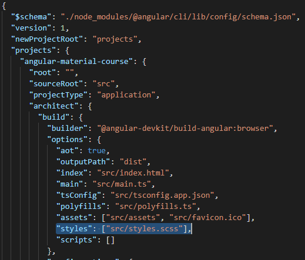

## 13. Custom material тема

В файле *src\styles.css* мы подключили angular-material-тему для нашего приложения:
```css
@import '~@angular/material/prebuilt-themes/indigo-pink.css';
```
Варианты доступных тем:
- indigo-pink
- deeppurple-amber
- pink-bluegrey
- purple-green

**Задача урока - научиться создавать кастомную тему**.

- Внутри *.angular-cli.json* изменяем конфигурацию CLI:
```json
{

  // ...

  "apps": [
    {
      "root": "src",
      "outDir": "dist",
      "assets": ["assets", "favicon.ico"],
      "index": "index.html",
      "main": "main.ts",
      "polyfills": "polyfills.ts",
      "test": "test.ts",
      "tsconfig": "tsconfig.app.json",
      "testTsconfig": "tsconfig.spec.json",
      "prefix": "",
      "styles": ["styles.scss"], // <-- styles.css заменить на styles.scss
      "scripts": [],
      "environmentSource": "environments/environment.ts",
      "environments": {
        "dev": "environments/environment.ts",
        "prod": "environments/environment.prod.ts"
      }
    }
  ],

  // ...

  "defaults": {
    "styleExt": "scss", // <-- css заменить на scss
    "component": {}
  }
}
```

- Для файла *src\styles.css* изменяем расширение .css на .scss

- Внутри *angular.json* меняем расширение .css на .scss для свойства build.options.styles:     
  

- Добавляем в *src\styles.scss* следующий код:
```scss
@import '~@angular/material/theming';

@include mat-core();

$primary: mat-palette($mat-green);
$accent: mat-palette($mat-pink, A200, A100, A400);

$theme: mat-light-theme($primary, $accent);

@include angular-material-theme($theme);
```

Для кастомизации темы - меняем цвета из списка ниже:

- Переменная **$theme** может принимать следующие значения:
  - mat-light-theme
  - mat-dark-theme

- Доступные цвета:
  - $mat-red
  - $mat-pink
  - $mat-purple
  - $mat-deep-purple
  - $mat-indigo
  - $mat-blue
  - $mat-light-blue
  - $mat-cyan
  - $mat-teal
  - $mat-green
  - $mat-light-green
  - $mat-lime
  - $mat-yellow
  - $mat-amber
  - $mat-orange
  - $mat-deep-orange
  - $mat-brown
  - $mat-grey
  - $mat-blue-grey

Исходный код `node_modules\@angular\material\_theming.scss`